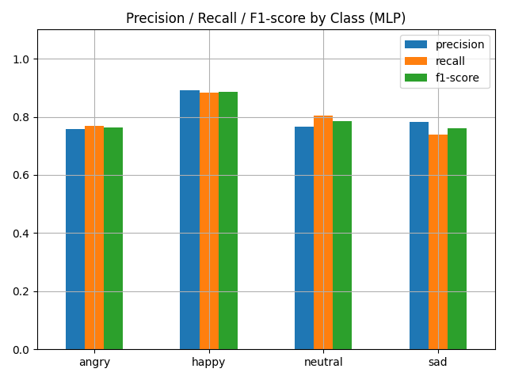
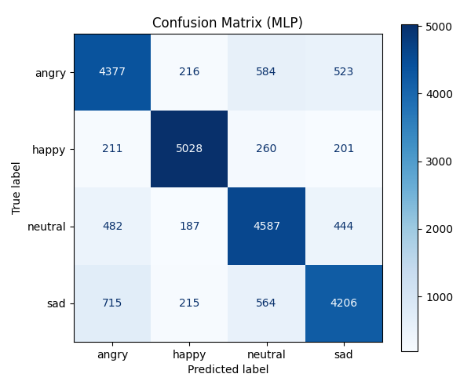

# StoneSpring

> ***“당신의 감정을 이해해주는 누군가가 있다면 어떨까요?”***
돌봄(StoneSpring)은 감정을 말하지 않아도 알아채는 AI 돌봄 친구 Dolbom과의 대화를 통해  
당신의 하루를 더 따뜻하게 만들어드립니다.

<div style="text-align: right">Team: 낭만(浪漫; NangMan)</div>

- 사용자 감정 분석 기반 정서 케어 챗봇  
- 표정/음성 인식, 자연어 처리, 일정 관리까지 GUI 통합 제공  
- PyQt5 기반 데스크탑 앱 + 딥러닝 기반 감정 분석 + KoBERT 의도 분석

---

## 프로젝트 소개
사용자의 외로움을 덜어주고, 일상생활에서 필요한 정보를 비서처럼 알려주며, 정신 건강을 챙겨주는 **돌봄 챗봇 GUI 프로그램**입니다. 향후에는 실제 돌봄 로봇과 결합하여 정서적 교감과 실질적 도움을 동시에 제공하는 통합 서비스를 목표로 합니다.

---
## 주제 선정 배경
최근 인공지능(AI) 기술의 급속한 발전과 함께 사용자와 자연스럽게 소통할 수 있는 챗봇(Chatbot)에 대한 관심이 증가하고 있습니다. 특히 고객 서비스, 교육, 의료 및 개인 비서 분야 등에서 챗봇의 활용이 폭발적으로 늘어나고 있으며, 이는 사용자의 편의성과 접근성을 크게 향상시키는 데 기여하고 있습니다.

동시에 사회적 변화로 인해 1인 가구가 증가하면서 정서적 외로움이나 심리적 스트레스 문제도 점차 심각해지고 있습니다. 혼자 사는 사람들은 귀가 후 대화 상대의 부재로 인해 심리적 안정과 정서적 지원이 부족한 상황이 많습니다. 이로 인해 디지털 포용(Digital Inclusion)과 정서적 지원의 중요성이 더욱 부각되고 있습니다.

기존의 챗봇 시스템은 주로 텍스트 기반의 소통에 머무르는 경우가 많았으나, 인간의 감정을 정확히 이해하고 공감하는 능력은 여전히 부족한 상태입니다. 이에 따라 최근에는 음성 및 감정 분석 기술을 접목하여 사용자의 정서를 더 정확히 파악하고, 대화를 통해 심신의 안정감과 편안함을 제공하는 챗봇의 필요성이 높아지고 있습니다.

본 프로젝트는 음성 감정 분석 기반 챗봇을 통해 사용자와의 소통 품질을 한 단계 높이고, 사용자의 감정을 인식하고 공감하는 방식으로 심리적 안정을 제공하고자 합니다. 이를 통해 1인 가구를 포함한 다양한 사용자에게 정서적 위안을 주고, 보다 편안하고 릴렉스한 생활 환경을 조성하는 것이 목표입니다.

이러한 챗봇 기술은 특히 정서적 지원이 필요한 고객 상담, 정신 건강 관리, 개인 맞춤형 서비스 등에서 혁신적이고 효과적인 활용 가능성을 지니고 있어 그 필요성과 가치가 매우 높다고 판단하여 본 주제를 선정하였습니다.

---

## **NangMan**팀 구성

| 역할   | 이름   | 작업 |
|--------|--------|------|
| 팀장   | 김연우 | 프로젝트 초기 설계<br>디렉토리 구조 및 실행 스크립트(run.sh) 구성<br>GPT-4o-mini 챗봇 업그레이드<br>릴리스 관리 |
| 팀원   | 나덕윤 | 음성 감정 모델 개발 (CNN+LSTM)<br>MFCC 추출 및 데이터 전처리<br>마이크 테스트 및 성능 개선 |
| 팀원   | 심채훈 | 제스처 인식 모듈화<br>MLP/SVC 얼굴 감정 모델 개발<br>PyQt 기반 GUI 통합 |
| 팀원   | 임동욱 | 제스처 모델 학습 |


---

## 폴더 구조 요약

```bash
├── ai/           # 딥러닝 모델 및 감정 분석 관련 코드
├── common/       # 공통 유틸리티 함수
├── core/         # 챗봇 핵심 로직 (감정 처리, 의도 분석 등)
├── db/           # 데이터베이스 초기화 및 연동 모듈
├── interface/    # 사용자 인터페이스 관련 모듈
├── views/        # PyQt5 기반 화면 구성 파일
├── network/      # 네트워크/서버 통신 관련 모듈 (확장 대비)
├── main.py       # 프로그램 실행 진입점
```

---

## 핵심 기술 요약 (Tech Highlights)
### 감정 인식 및 표현 분석
- **영상 기반 표정 분석**: 얼굴 표정을 분석하여 감정을 분류 (happy, sad, angry, neutral 등)
- **음성 기반 감정 판단**: 음성을 분석하여 감정 상태를 파악

### 자연어 처리 (NLP)
- **의도 분류 모델**: KoBERT 기반 분류기로 사용자의 입력 의도를 파악
- **대화 엔진**: HuggingFace Transformers 기반 문장 생성 또는 응답 템플릿 매칭

### 음성 입력 및 변환
- **음성 인식 입력**: SpeechRecognition을 통해 사용자 음성을 실시간 텍스트로 변환
- **TTS(Text-to-Speech)**: gTTS를 이용해 챗봇 응답을 음성으로 출력

### 정서 케어 및 페르소나 대화
- **심심이/캐릭터 스타일 페르소나**: 사용자 취향에 맞춰 다양한 대화 스타일 제공
- **감정 이력 기반 응답 튜닝**: 반복 감정 상태 저장을 통해 맞춤 대화 흐름 구현 중

### 시스템 구조 및 연동
- **PyQt5 기반 GUI 인터페이스**: 직관적인 감정 상태 시각화 및 대화 인터페이스
- **SQLite 연동**: 사용자 대화 로그, 감정 기록, 일정 등을 로컬 데이터베이스에 저장

---

## 기술 스택

| **분류**             | **사용 기술** |
|----------------------|------------------------------------------------------------------------------------------------------------------------------------------------------------------------------------------------|
| **프로그래밍 언어**  |  |
| **GUI 프레임워크**   |  |
| **영상 처리**        |  |
| **음성 처리**        |  &nbsp;  |
| **자연어 처리 (NLP)**|  |
| **데이터베이스**     |  |

---

## 시스템 구성

| 구성 요소           | 설명 |
|--------------------|------|
| 챗봇 인터페이스     | GUI 기반 사용자 대화 창 구성 |
| 자연어 처리 (NLP)   | 사용자 입력의 감정 및 의도 분석 |
| 감정 인식           | 표정(영상) 및 음성 기반의 감정 판단 |
| 대화 페르소나 시스템 | 사용자 맞춤형 대화 스타일 구현 (심심이, Character.AI 유사) |

---

## 영상기반 표정 분석 모델 성능

- **모델 구조**: DeepFace(ArcFace) 임베딩 + MLPClassifier (2 hidden layers: 128 → 64)
- **입력 데이터**: 표정 이미지 → DeepFace 임베딩 (벡터화)
- **클래스 구성**: angry, happy, neutral, sad (총 4개)
- **데이터 분할**: 학습 80% / 테스트 20% (Stratified 방식)

- **평가 지표**:
  - 전반적인 **Accuracy**: 약 **89~92% 수준**
  - 클래스별 Precision / Recall / F1-score:

    

  - Confusion Matrix:

    

  - 대용량 이미지 배치 처리 + 중간 저장 기능 탑재 (`.npy` 저장으로 중단 복구 가능)
  - 학습 모델 및 결과:
    - `./results/mlp_model.pkl`: 학습 완료된 모델 파일

---
## 🧠 음성 감정 분석 모델
### 사용된 기술
- 프레임 기반 음성 특성: MFCC
- 딥러닝 프레임워크: TensorFlow / Keras
- 최적화 함수: Adam
- 평가지표:
- Test Accuracy Epoch 30
  - 
  - 현재 저장된 모델은 epoch 230에 조기 종료된 Accuracy 96% 모델로 voice_emotion_model.keras or voice_emotion_model.h5 
---

## 참고 서비스

| 분류         | 사례 |
|--------------|------|
| 페르소나 챗봇 | [SimSimi](https://simsimi.com), [Character.AI](https://beta.character.ai/) |
| 로봇 + AI 펫  | Sony AIBO, RoboHon |
| 돌봄 로봇     | Pepper, ElliQ |

---

## 설치 및 실행 방법

```shell
bash run.sh
```
